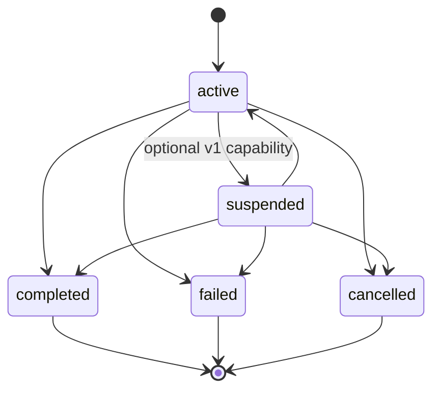
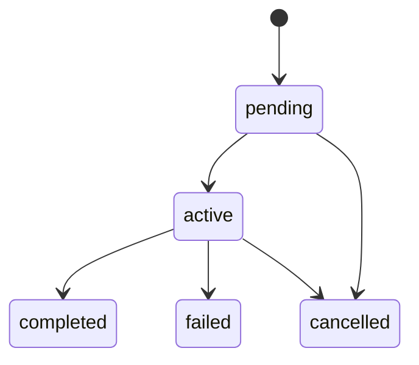
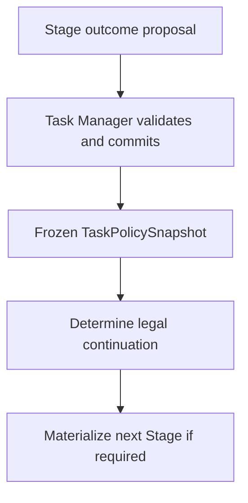
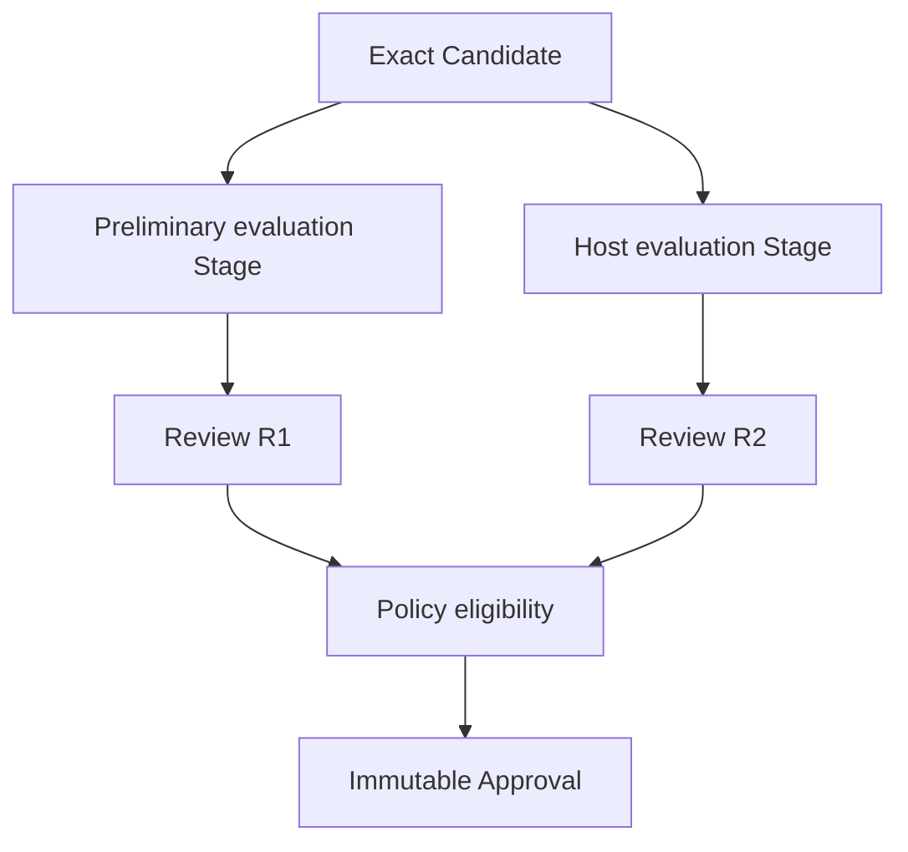
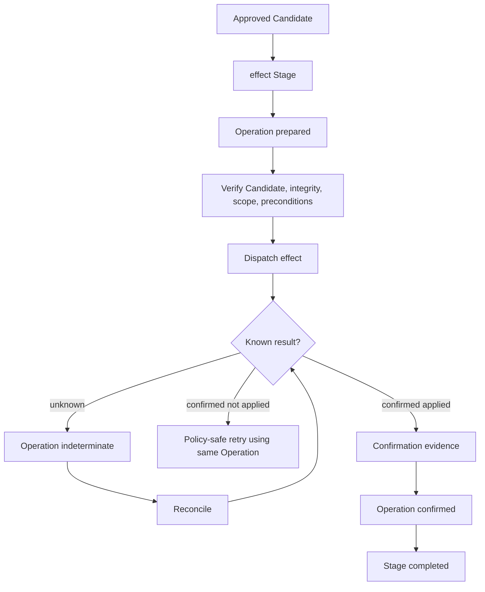

# Lifecycle and Continuation

This document describes durable lifecycle, continuation authority, retry/repair semantics, review-to-approval flow, effects, cancellation, and amendments.

## Task lifecycle



Terminal transitions are immutable. A terminal Task is never reopened.

`failed` means no legal continuation remains under frozen policy. Waiting for a provider, external reviewer, or reconciliation does not by itself imply failure.

## Stage lifecycle



`blocked` and `waiting` are projections over durable facts. They are not additional Stage lifecycle values.

A Stage fails only when its frozen realization/retry contract has no remaining legal realization path. Task Manager then evaluates policy to decide whether another Stage may be materialized or whether Task failure is required.

## Continuation authority

Plugins and executors do not decide workflow continuation.



> **Plugins propose outcomes; policy defines legal continuation; Task Manager materializes it.**

A `materializationKey` must make one semantic continuation decision stable across retries so the same next Stage is not accidentally materialized twice. Its exact canonical form remains an implementation decision.

## Retry versus repair

These concepts must remain distinct:

```text
retry
= same Stage, new Invocation

repair
= new Stage, new Candidate
```

A retry says the same semantic work unit is being realized again, potentially with a different provider binding. It advances execution generation and fences old attempts.

A repair says the semantic continuation has changed: a new Stage is materialized, and any resulting Candidate has new domain identity and optional revision lineage back to the prior Candidate.


## Candidate, Review, and Approval



Review records evidence. Approval records the acceptance-authority decision. An executor cannot convert its own success directly into Approval unless frozen policy explicitly grants that authority through a valid decision path.

Host/human review remains durable across session replacement because authority is represented by a frozen requirement and actual actor provenance, not by the identity of the transient session that delivered the command.

## Effect lifecycle

An authoritative external effect is coordinated through an effect Stage and Operation rather than Invocation.



Exact apply must verify the approved Candidate, immutable artifact integrity, frozen base/precondition, and current target preconditions. Drift fails closed rather than reinterpreting the Candidate.

## Invocation versus Operation indeterminate state

```text
Invocation indeterminate
→ fence the old generation
→ retry may be allowed

Operation indeterminate
→ reconcile external state
→ speculative retry is forbidden
```

This distinction follows from authority: ordinary realization can be fenced, while an already-dispatched authoritative effect may have happened even when the local process cannot prove it.

## Approval invalidation around dispatch

Before dispatch, loss of effective Approval may abort or supersede a prepared Operation and must prevent dispatch.

After dispatch, revocation cannot claim the effect did not occur. The Operation must continue through reconciliation until the external state receives a trustworthy terminal resolution.

> **Authority can be revoked before dispatch; after dispatch, reconciliation governs.**

## Cancellation

Cancellation is primarily an authority transition.

When a Task is cancelled, the system must:

- revoke permission for new authoritative outcome commits;
- fence the current Invocation generation;
- prevent new Stage materialization;
- best-effort cancel or terminate live executors.

A late executor result becomes stale historical evidence and cannot recover authority.

Already-dispatched Operations still require reconciliation because cancellation does not prove an external effect stopped or never happened.

> **Cancellation revokes authority; it does not prove execution ceased.**

## Amendments and policy change

Creation intent is immutable. Later requirements are represented by append-only amendments.

An amendment may be context-only or intent-changing; the exact taxonomy remains open. Intent-changing amendments require policy re-evaluation and may require new repair/revision Stages, renewed review, or invalidation of a previously effective Approval.

Historical Stage, Candidate, Review, and Approval meaning is never rewritten.

Active Tasks also do not silently adopt changed profile/plugin policy. Policy migration or revalidation must be explicit and auditable.

> **New intent may supersede old authority, but it must never rewrite the meaning of historical work.**